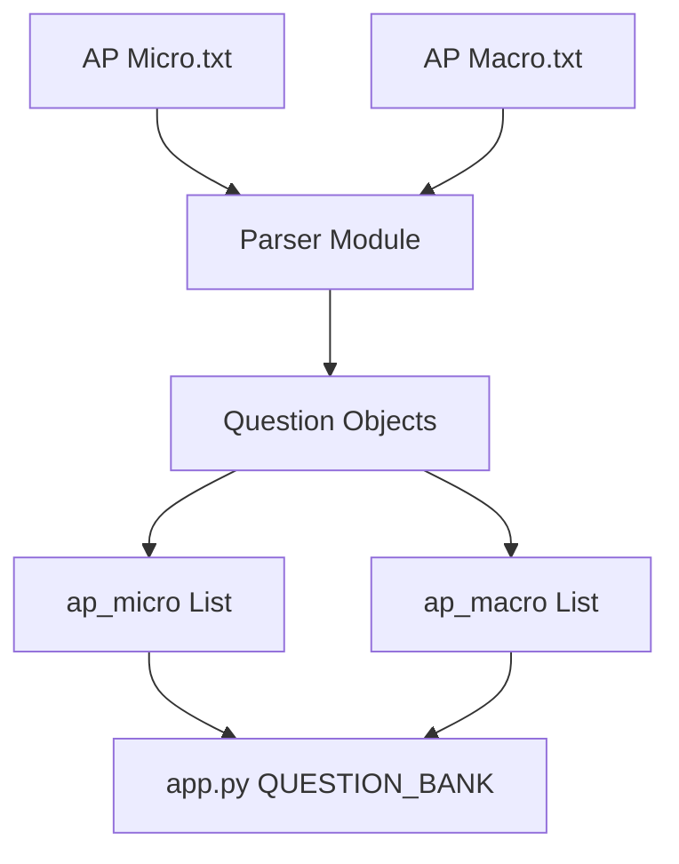

# AP经济学题库解析技术方案

## 1. 技术架构

### 1.1 架构图


### 1.2 技术栈
- **语言**: Python 3.x
- **依赖**: 仅使用标准库（re, json）
- **输出**: Python数据结构代码

## 2. 核心解析模块设计

### 2.1 主要类/函数

```python
class APQuestionParser:
    """AP经济学题目解析器"""
    
    def __init__(self, file_path: str, sections_map: dict):
        self.file_path = file_path
        self.sections_map = sections_map
        
    def parse(self) -> List[Dict]:
        """解析文件并返回题目列表"""
        content = self._read_file()
        questions_part, answers_part = self._split_content(content)
        questions = self._parse_questions(questions_part)
        answers = self._parse_answers(answers_part)
        return self._merge_and_enrich(questions, answers)
    
    def _read_file(self) -> str:
        """读取文件内容"""
        pass
    
    def _split_content(self, content: str) -> Tuple[str, str]:
        """分割题目部分和答案部分"""
        pass
    
    def _parse_questions(self, questions_part: str) -> Dict[int, Dict]:
        """解析题目内容"""
        pass
    
    def _parse_answers(self, answers_part: str) -> Dict[int, Dict]:
        """解析答案部分"""
        pass
    
    def _merge_and_enrich(self, questions: Dict, answers: Dict) -> List[Dict]:
        """合并题目和答案，添加章节信息"""
        pass
    
    def _get_section(self, question_id: int) -> str:
        """根据题号获取章节名称"""
        pass
```

## 3. 正则表达式模式

### 3.1 题目匹配模式
```python
# 匹配题号开头的题目
QUESTION_PATTERN = r'(?m)^(?P<num>\d+)\.\s+(?P<text>.+?)(?=\n\d+\.\s+|\n\([A-E]\)|$)'

# 匹配选项
OPTION_PATTERN = r'\(([A-E])\)\s*(.+?)(?=\n\([A-E]\)|\n\d+\.\s|$)'
```

### 3.2 答案匹配模式
```python
# 匹配答案行
ANSWER_PATTERN = r'(?m)^(?P<num>\d+)\.\s*\((?P<ans>[A-E])\)\s*(?P<exp>.+?)(?=\n\d+\.\s|\Z)'

# 备选答案格式
ANSWER_PATTERN_ALT = r'(?:Choice|correct choice is)\s*\(([A-E])\)'
```

## 4. 完整解析代码

```python
import re
from typing import List, Dict, Tuple

# AP Micro章节映射
MICRO_SECTIONS = {
    (1, 20): "Diagnostic Quiz",
    (21, 84): "Chapter 1 Basic Economic Concepts",
    (85, 187): "Chapter 2 Supply and Demand",
    (188, 276): "Chapter 3 Production, Cost, and the Perfect Competition Model",
    (277, 354): "Chapter 4 Imperfect Competition",
    (355, 439): "Chapter 5 Factor Markets",
    (440, 500): "Chapter 6 Market Failure and the Role of Government"
}

# AP Macro章节映射
MACRO_SECTIONS = {
    (1, 20): "Diagnostic Quiz",
    (21, 70): "Chapter 1 Basic Economic Concepts",
    (71, 170): "Chapter 2 Economic Indicators and the Business Cycle",
    (171, 230): "Chapter 3 National Income and Price Determination",
    (231, 315): "Chapter 4 The Financial Sector",
    (316, 440): "Chapter 5 Long-Run Consequences of Stabilization Policies",
    (441, 500): "Chapter 6 Open Economy—International Trade and Finance"
}


def get_section(question_id: int, sections_map: dict) -> str:
    """根据题号获取章节名称"""
    for (start, end), section in sections_map.items():
        if start <= question_id <= end:
            return section
    return "Unknown"


def parse_questions(file_path: str, sections_map: dict) -> List[Dict]:
    """解析AP题目文件"""
    
    with open(file_path, 'r', encoding='utf-8') as f:
        content = f.read()
    
    # 分割题目和答案部分
    parts = re.split(r'\nAnswers\n', content, flags=re.IGNORECASE)
    if len(parts) < 2:
        raise ValueError(f"无法找到Answers部分: {file_path}")
    
    questions_part = parts[0]
    answers_part = parts[1]
    
    # 解析题目
    questions = {}
    # 匹配题号开头的块
    question_blocks = re.findall(
        r'(?m)^(?P<num>\d+)\.\s+(?P<text>.+?)(?=\n\d+\.\s|\Z)',
        questions_part,
        re.DOTALL
    )
    
    for num_str, text in question_blocks:
        q_num = int(num_str)
        # 提取选项
        options = []
        option_matches = re.findall(r'\n\(([A-E])\)\s*(.+?)(?=\n\([A-E]\)|\Z)', text, re.DOTALL)
        
        if len(option_matches) == 5:
            for letter, opt_text in option_matches:
                opt_text = ' '.join(opt_text.split())
                options.append(f"({letter}) {opt_text}")
            
            # 提取题目内容（选项之前的部分）
            question_text = text[:text.find('(A)')].strip()
            question_text = ' '.join(question_text.split())
            
            questions[q_num] = {
                'question': question_text,
                'options': options
            }
    
    # 解析答案
    answers = {}
    # 匹配答案行
    answer_pattern = r'(?m)^(?P<num>\d+)\.\s*\((?P<ans>[A-E])\)\s*(?P<exp>.+?)(?=\n\d+\.\s|\Z)'
    answer_matches = re.findall(answer_pattern, answers_part, re.DOTALL)
    
    for num_str, ans_letter, explanation in answer_matches:
        a_num = int(num_str)
        explanation = ' '.join(explanation.split())
        answers[a_num] = {
            'answer': ans_letter,
            'explanation': explanation
        }
    
    # 合并题目和答案
    result = []
    for q_id in sorted(questions.keys()):
        if q_id in answers:
            q_data = questions[q_id]
            a_data = answers[q_id]
            section = get_section(q_id, sections_map)
            
            result.append({
                'id': q_id,
                'question': q_data['question'],
                'options': q_data['options'],
                'answer': a_data['answer'],
                'explanation': a_data['explanation'],
                'topic': section,
                'section': section,
                'difficulty': 'Medium'
            })
    
    return result


def generate_python_code(questions: List[Dict], var_name: str) -> str:
    """生成Python代码字符串"""
    lines = [f"{var_name} = ["]
    
    for q in questions:
        lines.append("    {")
        lines.append(f"        'id': {q['id']},")
        lines.append(f"        'question': {repr(q['question'])},")
        lines.append(f"        'options': {repr(q['options'])},")
        lines.append(f"        'answer': {repr(q['answer'])},")
        lines.append(f"        'explanation': {repr(q['explanation'])},")
        lines.append(f"        'topic': {repr(q['topic'])},")
        lines.append(f"        'section': {repr(q['section'])},")
        lines.append(f"        'difficulty': {repr(q['difficulty'])}")
        lines.append("    },")
    
    lines.append("]")
    return '\n'.join(lines)


# 主执行代码
if __name__ == '__main__':
    # 解析AP Micro
    ap_micro = parse_questions('AP Micro.txt', MICRO_SECTIONS)
    print(f"解析完成: {len(ap_micro)} 道AP Micro题目")
    
    # 解析AP Macro
    ap_macro = parse_questions('AP Macro.txt', MACRO_SECTIONS)
    print(f"解析完成: {len(ap_macro)} 道AP Macro题目")
    
    # 生成Python代码
    micro_code = generate_python_code(ap_micro, 'ap_micro')
    macro_code = generate_python_code(ap_macro, 'ap_macro')
    
    # 保存到文件
    with open('parsed_questions.py', 'w', encoding='utf-8') as f:
        f.write(micro_code)
        f.write('\n\n')
        f.write(macro_code)
    
    print("已保存到 parsed_questions.py")
```

## 5. 集成到app.py

生成的代码可以直接替换app.py中的QUESTION_BANK：

```python
QUESTION_BANK = {
    'ap_micro': ap_micro,
    'ap_macro': ap_macro
}
```

## 6. 验证步骤

1. **数量验证**: 确保每个列表包含500道题目
2. **ID连续性**: 验证ID从1到500连续
3. **选项完整性**: 每道题都有5个选项
4. **答案匹配**: 答案字母在A-E范围内
5. **章节映射**: 验证section字段正确

## 7. 注意事项

1. 文本文件可能包含特殊字符，需要正确处理编码
2. 某些题目可能跨越多行，需要正确处理换行
3. 答案解释可能包含多行文本，需要正确合并
4. 章节标题在文本中可能出现多次，需要基于题号范围映射
